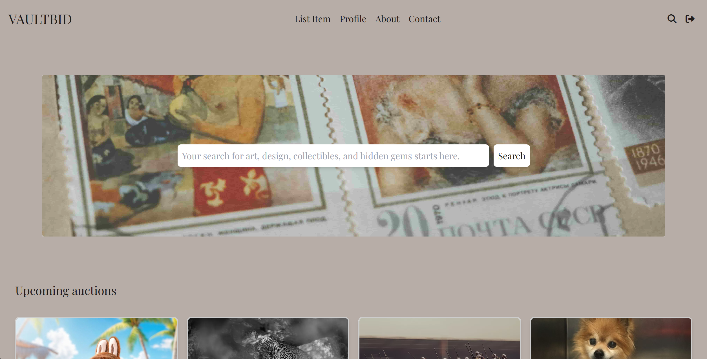

# VaultBid



This is a school project where I created a website using HTML, JS and Tailwind CSS.

## To wiew live application, visit:

**[Vaultbid](https://vaultbid.netlify.app/)**

## Description

This website is for a auctionhouse. First, I designed the website using FIGMA, and then I built it using HTML for structure, JS for functionality, and CSS for styling.

## Site architecture

- Home
- Profile
- Single listing
- Create listing
- Login
- Register
- About us
- Contact us
- Terms & conditions
- Privacy policy

## Built With

- HTML
- CSS (Tailwind)
- JS

## Features

- User-friendly interface
- Responsive design for mobile and desktop
- Contact form
- Login
- Register

## Getting Started

### Prerequisites

Ensure you have the following installed:

- npm (Node Package Manager)

### Installing

1. Clone the repository:

```bash
git clone https://github.com/omro0107/VaultBid.git
```

2. Navigate to the project directory

```bash
cd VaultBid
```

3. Install the dependencies

```bash
npm install
```

### Running

To run the app, run the following commands:

```bash
npm run start
```

### Usage

After starting the app, open your web browser and go to http://localhost:3000 to view the website.

## Contributing

Contributions are welcome! Please follow these steps:

1. Fork the project.
2. Create a new branch (git checkout -b feature-name).
3. Commit your changes (git commit -m 'Add some feature').
4. Push to the branch (git push origin feature-name).
5. Create a new Pull Request.

## Contact

[My LinkedIn page](https://www.linkedin.com/in/oda-marie-rosenkilde-9b0919287/)

## License

This project is created for educational purposes and is released under GNU GENERAL PUBLIC LICENSE. See LICENCE.md file for more information.

## Acknowledgments

Images from www.unsplash.com
